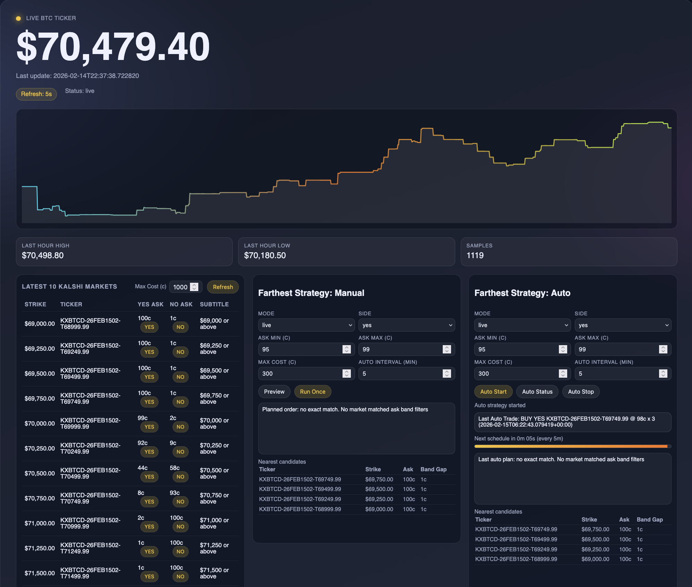

# Hades Prediction Market

A research-grade trading workstation for Kalshi's Bitcoin hourly markets. It ingests live BTC price data, maps it to the currently active Kalshi market, stores snapshots in SQLite, and serves a real-time dashboard plus API endpoints for downstream strategy work.

The core objective is to evolve from signal collection into automated, risk-aware execution.

## Dashboard


The dashboard includes:
- Live BTC price, timestamp, event ticker, and large expiry countdown.
- Top-middle portfolio snapshot (Cash + Portfolio) beside BTC/expiry.
- Compact BTC trend graph with hover tooltip (time + price).
- `Latest 10 Kalshi Markets` panel:
  - One-click YES/NO order buttons.
  - Configurable `Max Cost (c)`.
  - Bright row highlighting for rows where YES ask is in the 90-99c band.
  - Inline error/success status with per-row pending/error/success highlighting.
- Four top panels in one row on desktop:
  - `Latest 10 Kalshi Markets`
  - `Farthest Strategy: Manual`
  - `Farthest Strategy: Auto`
  - `Current Portfolio`
- `Farthest Strategy: Manual`:
  - `Preview` + `Run Once`.
  - Planned order and nearest-candidates output.
- `Farthest Strategy: Auto`:
  - `Auto Start`, `Auto Status`, `Auto Stop`.
  - Next scheduled-run countdown + progress bar.
  - Stop-loss schedule panel (next risk check + protected positions).
  - Last auto trade badge.
  - Planned order and nearest-candidates output.
- `Current Portfolio`:
  - BTC-only filter toggle.
  - Auto-refresh every 3 seconds.
  - Per-position table (side/cost/P/L/max) and summary.
- `Trade Ledger`:
  - Recorded buy/sell legs from direct order route and strategy paths.
  - Includes source, mode, action, price/count/cost, status, and note.
- `P/L Summary (All Orders)`:
  - Realized/unrealized/net/fees totals.
  - Per-market breakdown from historical fills/orders.


## Highlights
- Live BTC price from Kraken.
- Kalshi market discovery for the current hour.
- Continuous ingest pipeline with SQLite storage.
- FastAPI service with JSON endpoints and a built-in dashboard.
- Persistent trade ledger in SQLite for buy/sell calls (timestamp, price, side, ticker, status, payload).
- Strategy auto state with seeded active positions from live portfolio.
- FIFO-style realized/unrealized/net P/L summary from historical orders.

## Requirements
- Python 3.11+

## Architecture
1. **Market discovery**: Identify the current Kalshi event ticker based on the next hour (ET).
2. **Price fetch**: Pull the latest BTC price from Kraken.
3. **Market snapshot**: Fetch Kalshi YES/NO quotes for the event.
4. **Ingest**: Store snapshots in SQLite and prune old data.
5. **Serve**: FastAPI provides API routes and a real-time dashboard.

## Quickstart
### 1) Create a virtual environment
```bash
python -m venv .venv
source .venv/bin/activate
```

### 2) Install dependencies
```bash
pip install fastapi uvicorn requests cryptography python-dotenv pytz
```

### 3) Configure environment
Copy your `.env` file and set:
- `KALSHI_API_KEY`
- `KALSHI_PRIVATE_KEY`
- `KALSHI_BASE_URL`
- `KALSHI_DB_PATH`
- `OPENAI_API_KEY` (optional, future use)
- `XAI_API_KEY` (optional, future use)

Notes:
- `KALSHI_PRIVATE_KEY` should point to your private key PEM.
- set `KALSHI_DB_PATH` to override the default SQLite path.
- Do not commit secrets. `.env` is already ignored by git.


### 4) Run the API server + dashboard
```bash
python3 -m src.api
```
- This continuously writes market snapshots to `data/kalshi_ingest.db` (once per second) and prunes data older than 24 hours.
- Then open: `http://localhost:8090/dashboard`

## API Endpoints
- `GET /get_price_ticker`
  - Returns the latest BTC price from Kraken.
- `GET /kalshi_ingest/latest`
  - Returns the most recent Kalshi ingest snapshots (last 2 hours).
- `GET /kalshi_ingest/last_hour`
  - Returns BTC price samples for the last hour.
- `GET /kalshi/place_best_ask_order?side=yes|no&ticker=...&max_cost_cents=...`
  - Places a best-ask limit order for YES/NO based on the current order book.
- `GET /kalshi/portfolio/balance`
  - Returns current portfolio balance.
- `GET /kalshi/portfolio/orders`
  - Returns current orders (filter with `status`, `ticker`, `limit`).
- `GET /kalshi/portfolio/current`
  - Returns portfolio balance and current positions/orders with estimated cost, mark-based P/L, and max payout.
- `GET /kalshi/pnl/summary`
  - Aggregates order history into buys/sells/fees plus realized, unrealized, and net P/L.
  - Includes per-market breakdown and diagnostics (`orders_considered`, `fills_count`, etc.).
- `GET /kalshi/portfolio/positions_debug`
  - Returns raw positions payload plus a small sample for debugging field mappings.
- `GET /strategy/farthest_band/preview?side=yes|no&ask_min_cents=95&ask_max_cents=99&max_cost_cents=500`
  - Uses latest spot + latest ingest snapshot to show the planned order (lower-direction strategy only).
  - If no exact band match exists, returns nearest candidates.
- `GET /strategy/farthest_band/run?side=yes|no&ask_min_cents=95&ask_max_cents=99&max_cost_cents=500&mode=paper|live`
  - Executes one strategy cycle immediately.
  - `mode=paper` returns planned action only; `mode=live` places a real order.
  - If an active tracked position loss is greater than `25%`, it exits and attempts to rebuy a farther strike.
- `GET /strategy/farthest_band/run?side=yes|no&ask_min_cents=95&ask_max_cents=99&max_cost_cents=500&mode=paper|live&force_new_order=1`
  - Forces a fresh entry on run-once (ignores currently tracked active position state).
- `GET /strategy/farthest_band/auto/start?side=yes|no&ask_min_cents=95&ask_max_cents=99&max_cost_cents=500&mode=paper|live&interval_minutes=15`
  - Starts background auto-execution on interval (default 15 minutes).
  - Seeds strategy-tracked active positions from live portfolio (matching latest event prefix/tickers).
  - Auto cycles apply the same stop-loss exit-and-rotate behavior.
  - Stop-loss/risk evaluation cadence is `min(5 minutes, time to next scheduled run)`.
  - Scheduled interval runs add a new entry when a candidate exists, without selling the current active position.
  - Sells happen only on stop-loss or ticker rollover.
- `GET /strategy/farthest_band/auto/status`
  - Returns running state, active config, last run time, and last result.
- `GET /strategy/farthest_band/auto/stop`
  - Stops background auto-execution.
- `GET /strategy/farthest_band/reset`
  - Clears tracked strategy active position/state cache.
- `GET /ledger/trades?limit=200`
  - Returns the latest ledger records for buy/sell calls from direct order route and strategy runs/auto cycles.
  - Fields include timestamp, action, side, ticker, price/count/cost, status, source, and payload snapshot.

## Stop-Loss Behavior
- Threshold:
  - Triggered when unrealized PnL is strictly below `-25%` from entry price (`loss > 25%`).
  - PnL formula: `(mark_price_cents - entry_price_cents) / entry_price_cents`.
- Mark source:
  - YES positions use `yes_bid`.
  - NO positions use `no_bid`.
  - If bid is unavailable, stop-loss mark is treated conservatively as `0`.
- `Preview`:
  - Selection only, no orders, no stop-loss actions.
- `Run Once`:
  - If no active tracked position, enters selected candidate.
  - If active position exists, evaluates stop-loss; on trigger, exits then re-enters farther strike.
  - With `force_new_order=1`, ignores active tracked state and enters fresh immediately.
- `Auto`:
  - Scheduled interval runs follow `interval_minutes`.
  - Stop-loss checks run on risk cadence (`min(5m, time-to-next-schedule)`).
  - On scheduled runs, can add new entries without closing existing positions.
  - On stop-loss trigger, exits active position at market-like executable bid and re-enters a farther candidate.
  - Re-entry excludes the same ticker and enforces farther distance than the exited strike.
  - On hourly event rollover, exits stale ticker and re-enters from latest ingest markets.
- Entry selection risk filters:
  - Default ask band is `95-99c`.
  - Strategy skips the nearest 2 strike levels in the chosen direction (`skip_nearest_levels=2`) before selecting.
- Execution modes:
  - `paper`: decision path only, no exchange order.
  - `live`: real Kalshi orders are submitted for exit/re-entry.
- Visibility:
  - Every buy/sell leg (run, auto, and direct order route) is written to `trade_ledger`.
  - Use `GET /ledger/trades` or the dashboard Trade Ledger panel to verify actions.
  - Use `GET /kalshi/pnl/summary` for aggregate realized/unrealized/net P/L.


## Repository Layout
```
src/
  api.py                        # FastAPI app and dashboard UI
  client/
    kalshi_client.py            # Signed API client for Kalshi
    kraken_client.py            # Kraken BTC price client
  offline_processing/
    ingest_kalshi.py            # Ingest loop + SQLite storage
    generate_all_kalshi_urls.py # Utility for batch Kalshi URLs
    kalshi_urls_2026.txt        # Precomputed URLs
  utils/
    fetch_current_predictions_kalshi.py  # Pull markets + normalize
    get_current_trading_markets.py       # Resolve current market URL

data/
  kalshi_ingest.db              # SQLite ingest store (generated)
```

## Strategy Roadmap (High Level)
- Integrate LLM-assisted market selection (OpenAI/xAI).
- Add risk controls (exposure caps, kill-switches, dry-run mode).
- Enhance execution logic (slippage tolerance, order retries).
- Expand market coverage beyond BTC hourly.

## Safety & Compliance
This repository is for research and experimentation. Prediction markets involve real financial risk. Ensure you understand Kalshi's rules and applicable regulations before trading.

## Disclaimer
This software is provided "as is" with no warranties. Use at your own risk.
